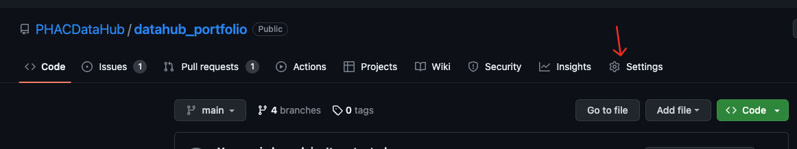
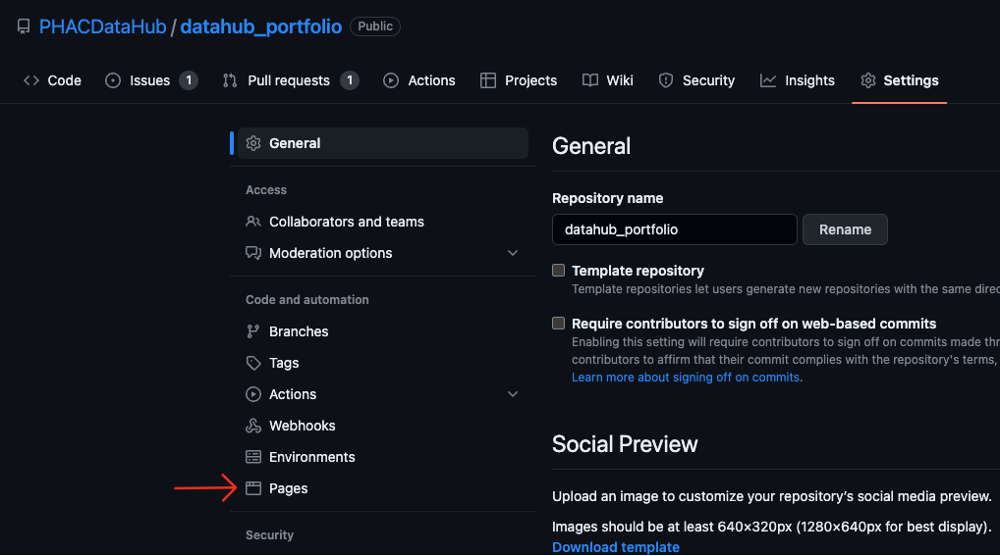
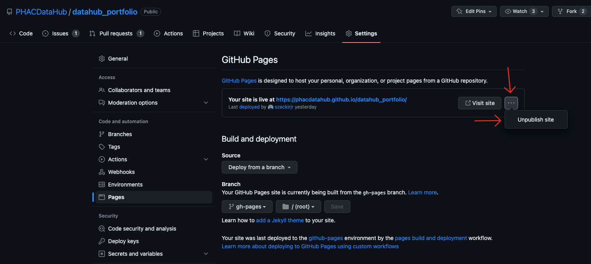
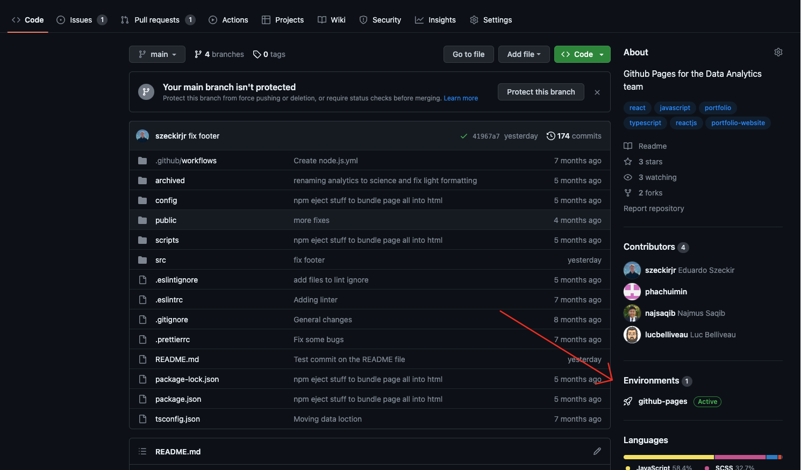

# Data Science Portfolio

The Data Science Portfolio can be accessed by clicking <a href="https://phacdatahub.github.io/datahub_portfolio/" target="_blank">here</a>

The page is developed using React in TypeScript and it is being hosted and deployed by GitHub using GitHub Pages.

# Run Locally

In order to run locally, you must have [Node](https://nodejs.org/en/) installed.

1. Clone the repository

2. Install the dependencies

```bash
npm install
```

3. Run the application

```bash
npm start
```

# How to make updates

All data for the portfolio is stored in the `src/data` folder. The data is stored in JSON files and is defined by types in the `src/utils/types` folder.

There are 4 main sections of the portfolio, and each is defined by a JSON file:

1. Product List (`productList.ts`)
   This is the list of products displayed at the top of the page. This includes LiquidFiles, Databricks, LimeSurvey, etc.
   They are defined under the `productList.ts` file and have the following type:

   ```typescript
   export type Product = {
     name: string; // Name of the product
     cardImage: string; // Image displayed on the card
     categories: string[]; // List of categories shown in modal - see tagColors.ts for standard categories
     slogan: string; // Slogan displayed on the card
     description: string[]; // Description displayed in the modal
     url: string; // URL to the product
     images: string[]; // List of images displayed in the modal
     color?: string; // Color of the Learn More button
     comingSoon?: boolean; // If true, the product will be displayed as coming soon and will not be clickable
   };
   ```

2. Project Pages (`projectPages.ts`)
   This is the list of projects displayed in the Projects section of the page. It includes all active and complete projects.
   They are defined under the `projectPages.ts` file and have the following type:

   ```typescript
   export type ProjectPage = {
     id: string; // Unique ID for the project
     name: string; // Name of the project
     status: 'active' | 'closed'; // Status of the project - shows project in the appropriate section
     description: string; // Description of the project
     importantLinks?: Link[]; // List of important links for the project
     background?: string[]; // Background information for the project - one paragraph per string
     problem?: string[]; // Problem statement for the project - one paragraph per string
     goal?: string[]; // Goal of the project - one paragraph per string
     solution?: string[]; // Solution for the project - one paragraph per string
     images: string[]; // List of images displayed in the page
     cardImage: string; // Image displayed on the card
     tools: string[]; // List of tools used in the project
     successMetrics?: string[]; // List of success metrics for the project - one paragraph per string
     comingSoon?: boolean; // If true, the project will be displayed as coming soon and will not be clickable
   };
   ```

   Note that the important links are defined by the following type:

   ```typescript
   interface Link {
     label: string; // What to display
     url: string; // Where to link to
   }
   ```

3. Tool Inventory (`toolInventory.ts`)
   This is the list of tools displayed in the Tools section of the page. It displays a little card with the logo, categories, and information about how the tool is used.
   They are defined under the `toolInventory.ts` file and have the following type:

   ```typescript
   export type InventoryTool = {
     name: string; // Name of the tool
     categories: string[]; // List of categories shown in modal - see tagColors.ts for standard categories
     cost: string; // Cost of the tool for the team (e.g. Free, Depends on usage, etc.)
     protected_b_data: boolean; // Whether the tool can handle protected B data
     url: string; // URL to the tool
     self_hosted_version: boolean; // Whether the tool has a self-hosted version available
     teams: string[]; // List of teams using the tool - see tagColors.ts for standard teams
     projects: string[]; // List of projects using the tool - see tagColors.ts for standard projects
     image: string; // Logo of the tool
   };
   ```

4. Other Useful Tools (`otherUsefulTools.ts`)
   This is the final list of tools shown at the bottom of the page. It only includes a list of other tools and links to their websites.
   They are defined under the `otherUsefulTools.ts` file and have the following type:

   ```typescript
   export type OtherTool = {
     name: string; // Name of the tool
     url: string; // URL to the tool
   };
   ```

# How to take the deployment down

1. Go to the repository settings
   

2. Go to the GitHub Pages section
   

3. Select the site and unpublish it
   

You can confirm that the deployment is down by going to https://phacdatahub.github.io/datahub_portfolio/ and seeing that the page is not found.

# How to deploy

Under `package.json`, there is a script called `deploy`. This script will build the application and deploy it to GitHub Pages.

So after installing the dependencies and making any changes (see [Run Locally](#run-locally) above), you can run the following command:

```bash
npm run deploy
```

You can check the environments in GitHub to see if the deployment was successful.



If so, the page should be accessible at https://phacdatahub.github.io/datahub_portfolio/
